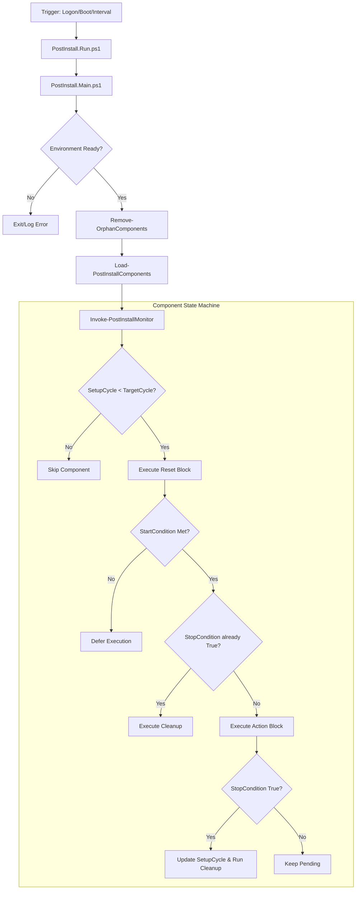

# Pulse Runner: Post-Install Framework

A professional "Plug and Play" automation engine for Windows. This framework manages per-user configurations through modular **Components**, using a resilient state-machine architecture to handle versioning, execution, and cleanup via a background "Pulse" monitor.

## 🌟 System Overview

Pulse Runner solves the problem of managing user-profile configurations at scale. It allows administrators to deploy a core engine once, while allowing users (or automated delivery systems) to "drop" new logic into a local folder. 

### Key Features
- **Plug & Play:** Logic is added by placing `.ps1` files in the `%LOCALAPPDATA%\Components` directory.
- **State Machine Architecture:** Components follow a defined lifecycle: `Reset` → `StartCondition` → `Action` → `StopCondition` → `Cleanup`.
- **Headless Execution:** Runs silently via `conhost.exe --headless` to ensure zero user interruption.
- **Self-Healing:** Automatically identifies and purges "orphan" registry entries if component files are deleted.
- **Resilient Triggers:** High availability via Task Scheduler (Logon, Boot, and 1-minute intervals).

## 🔄 System Flow & Lifecycle

The following diagram illustrates the transition from the Scheduled Task trigger to individual component execution.



## 🧠 Registry State Machine & Versioning

The framework uses `HKEY_CURRENT_USER\Software\PostInstall` as its persistent database.

### The Cycle Logic
Every component is governed by two version integers:
*   **`SetupCycle`**: The version level currently achieved on the user's profile.
*   **`TargetCycle`**: The desired version level. 
*   **Logic**: If `SetupCycle < TargetCycle`, the runner initiates the execution sequence.

### Registry Example
A component named **"DemoComponent"** that has successfully run once would look like this in the registry:

**Path:** `HKCU\Software\PostInstall\Components\DemoComponent`

| Value Name | Type | Value | Description |
| :--- | :--- | :--- | :--- |
| **SetupCycle** | REG_DWORD | `1` | Current version applied to user. |
| **TargetCycle** | REG_DWORD | `1` | Desired version level. |
| **LastRun** | REG_QWORD | `1335...` | FileTime of the last execution. |
| **DemoValue** | REG_SZ | `"Hello..."` | Custom data stored by the component. |

> **Note:** Administrators can create the same path in `HKEY_LOCAL_MACHINE`. If the `TargetCycle` in HKLM is higher than the user's `SetupCycle`, the monitor will sync the value to HKCU and force a re-run.

## 🔍 Context API ($context)

Components interact with the system via a **read-only** object, keeping them decoupled from the engine:
- **`$context.LogonId`**: The unique Session ID (via CIM/WMI).
- **`$context.BootTime`**: OS `LastBootUpTime`.
- **`$context.ComponentRegistry`**: Safe registry path for component-specific persistence.
- **`$context.Log`**: Delegate to the rotating log utility (`PostInstall.log`).

## 🚀 Deployment & Usage

### 1. Installation (Admin Required)
```powershell
# Install to default C:\Windows\Scripts
.\Install.ps1

# Install to custom path
.\Install.ps1 -InstallDirectory "C:\Automation"

# Complete removal
.\Install.ps1 -Uninstall
```

### 2. Creating a Component
Create a `.ps1` file in `%LOCALAPPDATA%\Components`. Use the `New-PostInstallComponent` factory to define your logic. (Refer to `DemoComponent.ps1` for a full template).

```powershell
$Component = New-PostInstallComponent `
    -Name "MyTask" `
    -Action { 
        param($context)
        $context.Log.Invoke("Running MyTask...")
    } `
    -StopCondition { param($context); return $true }
```

---
*Created for robust, scalable user-profile automation.*

## License
**MIT License**

Copyright (c) 2024

Permission is hereby granted, free of charge, to any person obtaining a copy of this software and associated documentation files (the "Software"), to deal in the Software without restriction, including without limitation the rights to use, copy, modify, merge, publish, distribute, sublicense, and/or sell copies of the Software, and to permit persons to whom the Software is furnished to do so, subject to the following conditions:

The above copyright notice and this permission notice shall be included in all copies or substantial portions of the Software.
